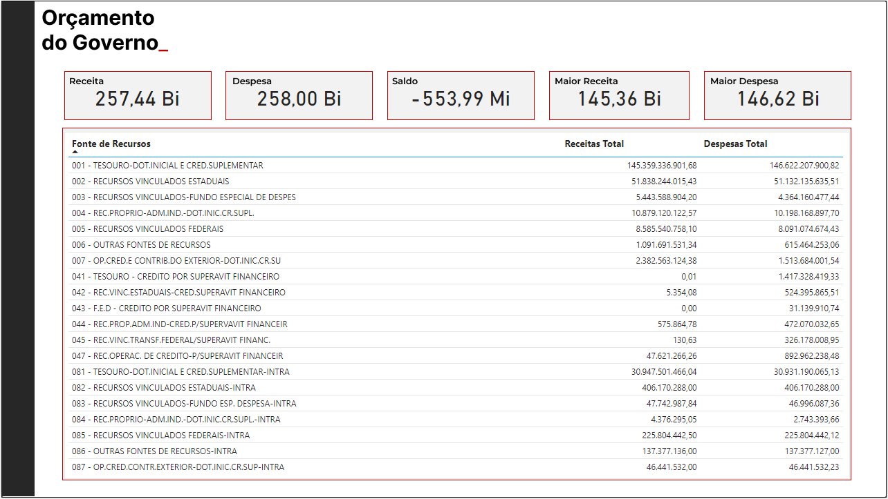

# ETL Pipeline com Airflow e PySpark

Este projeto implementa um pipeline de ETL (Extract, Transform, Load) utilizando **Apache Airflow**, **PySpark** e Docker. O pipeline processa dados financeiros de receitas e despesas em várias camadas (bronze, silver, gold) e realiza backups automatizados dos resultados.

---

## 🚀 Tecnologias Utilizadas

- **Apache Airflow**: Orquestração de tarefas.
- **PySpark**: Processamento de dados.
- **Docker**: Contêineres para isolar e gerenciar o ambiente.
- **PostgreSQL** (Opcional): Para armazenamento de dados estruturados.

---

## 📂 Estrutura do Projeto

```
projeto_etl/
├── backups/       # Backups automatizados
├── dags/          # Scripts do pipeline ETL
├── data/          # Dados de entrada
├── logs/          # Logs gerados pelo Airflow
├── output/        # Resultados do processamento ETL
├── Dockerfile     # Configuração do contêiner
├── Airflow.cfg    # Configuração refinada do airflow 
├── docker-compose.yaml
├── requirements.txt
└── README.md
```

---

## ⚙️ Configuração do Ambiente

### Pré-requisitos

- **Docker** e **Docker Compose** instalados.
- Conta no GitHub configurada (opcional para entrega).

### Passos de Configuração

1. **Clone o repositório**:
   ```bash
   git clone https://github.com/Sephiroth-jr/Airflow_pyspark.git
   cd Airflow_pyspark
   ```

2. **Inicie os contêineres**:
   ```bash
   docker-compose up -d
   ```

3. **Acesse o Airflow**:
   Abra seu navegador em [http://localhost:8080](http://localhost:8080) e use as credenciais padrão:
   - Usuário: `airflow`
   - Senha: `airflow`

4. **Carregue os dados**:
   Insira os arquivos de entrada (`gdvReceitasExcel.csv` e `gdvDespesasExcel.csv`) no diretório `data/`.

5. **Inicie o pipeline**:
   No Airflow, ative e execute a DAG `etl_pipeline`.

---

## 🛠️ Componentes do Pipeline

### 1. Camada Bronze
- Lê os arquivos CSV de entrada.
- Remove colunas desnecessárias e realiza limpeza básica dos dados.
- Armazena os dados limpos no formato csv.

### 2. Camada Silver
- Deduplica os dados da camada Bronze.
- Remove valores nulos e ajusta tipos de dados.
- Armazena os dados processados em uma estrutura mais padronizada.

### 3. Camada Gold
- Realiza agregações como totais de receitas e despesas por categoria.
- Produz datasets prontos para análise.

### 4. Backup
- Compacta os resultados do pipeline e cria arquivos de backup no diretório `backups/`.

### 5. Validação
- Verifica a integridade dos arquivos de backup e migra os arquivos para a pasta de validation.

### 6. Exportação para o PostgresSQL
- Verifica os dados da camada gold e faz a importação da tabela de receitas e despesas para o postgres automaticamente após execução da dag.

### 7. Conexão com o Microsoft Power BI via conexão padrão PostgresSQL
- Foi feita a conexão usando o Power BI para criação do dashboard. 

---

1. Certifique-se de que os arquivos gerados pela camada Gold estão disponíveis em `/opt/airflow/output/gold`.
2. Abra o Power BI e clique em "Obter Dados".
3. Selecione "Arquivos CSV" ou configure a conexão com o PostgreSQL usando as credenciais:
   - Host: localhost
   - Porta: 5432
   - Banco de Dados: airflow
   - Senha: Airflow
4. Carregue os dados e visualize os dashboards predefinidos.

## Relatório Power BI - Análise de Receita e Despesa



O gráfico acima mostra a relação entre receita e despesa por categoria de fonte de recurso, destacando os principais numeros extraídos do relatório.

---

## 🔍 Comandos Úteis
### Gerenciamento do Projeto

- **Subir contêineres**:
  ```bash
  docker-compose up -d
  ```
- **Parar contêineres**:
  ```bash
  docker-compose down
  ```
- **Acessar o Airflow Webserver**:
  [http://localhost:8080](http://localhost:8080)

### Limpar Diretórios (opcional para reiniciar o projeto)

```bash
rm -rf logs/* output/* backups/*
```

### Configuração no Git

```bash
git add .
git commit -m "Atualização do projeto ETL"
git push origin main
```

---

## 📝 Observações

- Certifique-se de que os arquivos de entrada (`gdvReceitasExcel.csv` e `gdvDespesasExcel.csv`) estejam na pasta `data/` antes de executar o pipeline.
- Use o `.gitignore` para evitar rastrear pastas como `logs/`, `backups/` e `output/`.

---

## 📧 Contato

Se tiver dúvidas ou sugestões, entre em contato pelo GitHub: [Sephiroth-jr](https://github.com/Sephiroth-jr).
